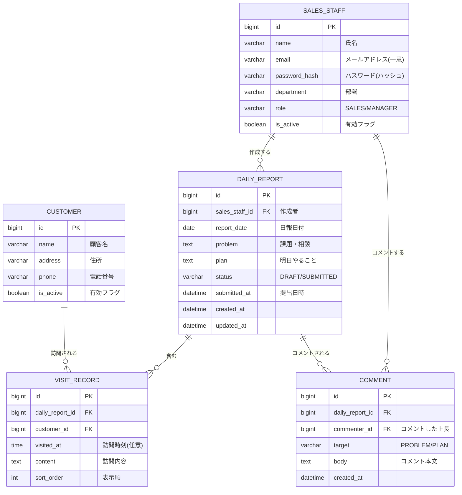

# 営業日報システム ER図

```mermaid
erDiagram
    SALES_STAFF ||--o{ DAILY_REPORT : "作成する"
    SALES_STAFF ||--o{ COMMENT : "コメントする"
    DAILY_REPORT ||--o{ VISIT_RECORD : "含む"
    CUSTOMER ||--o{ VISIT_RECORD : "訪問される"
    DAILY_REPORT ||--o{ COMMENT : "コメントされる"

    SALES_STAFF {
        bigint id PK
        varchar name "氏名"
        varchar email "メールアドレス(一意)"
        varchar password_hash "パスワード(ハッシュ)"
        varchar department "部署"
        varchar role "SALES/MANAGER"
        boolean is_active "有効フラグ"
    }

    CUSTOMER {
        bigint id PK
        varchar name "顧客名"
        varchar address "住所"
        varchar phone "電話番号"
        boolean is_active "有効フラグ"
    }

    DAILY_REPORT {
        bigint id PK
        bigint sales_staff_id FK "作成者"
        date report_date "日報日付"
        text problem "課題・相談"
        text plan "明日やること"
        varchar status "DRAFT/SUBMITTED"
        datetime submitted_at "提出日時"
        datetime created_at
        datetime updated_at
    }

    VISIT_RECORD {
        bigint id PK
        bigint daily_report_id FK
        bigint customer_id FK
        time visited_at "訪問時刻(任意)"
        text content "訪問内容"
        int sort_order "表示順"
    }

    COMMENT {
        bigint id PK
        bigint daily_report_id FK
        bigint commenter_id FK "コメントした上長"
        varchar target "PROBLEM/PLAN"
        text body "コメント本文"
        datetime created_at
    }
```
